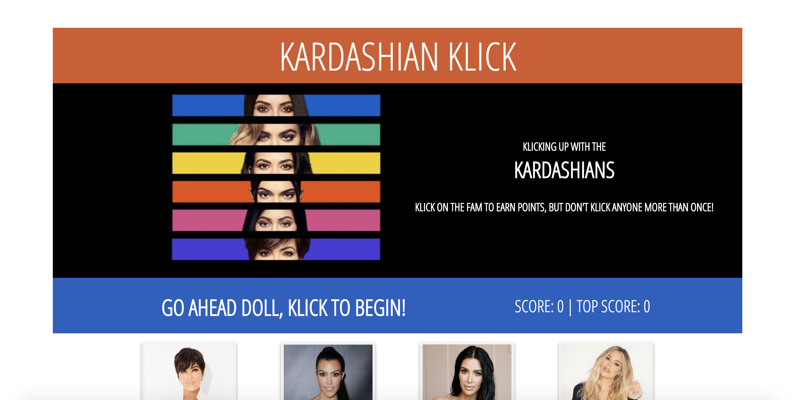
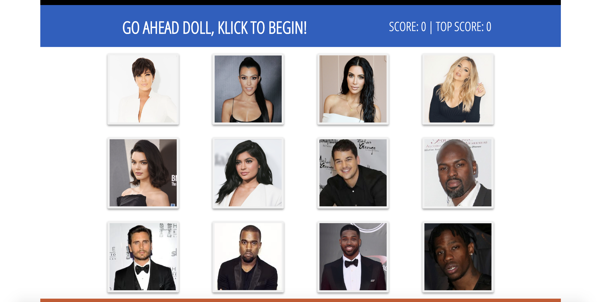
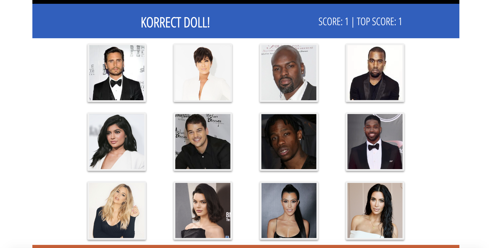
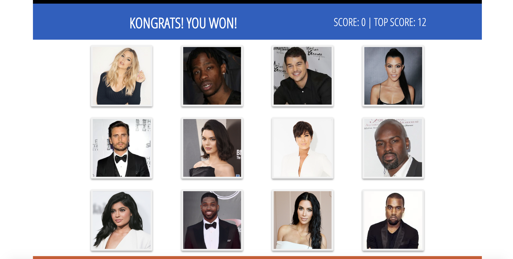

# Klicking Up With The Kardashians Game
## Memory Game

## How It Works
Twelve fam members from *Keeping Up With The Kardashians* are shown on the cards.
Click a member of the fam to earn a point. On click, the cards with randomly shuffle. Click another member of the fam, but don't click someone you've already selected or you'll have to start again.

Fam members appear on the cards

On-click the cards will randomly shuffle, your score will update and a message of "Korrect Doll!" or "Inkorrect, kan't you keep up?" will appear in the status bar depending on your selection.

If you select all twelve in the fam without repeating, a message of "Kongrats! You won!" will appear, your score will reset to zero and the Top Score will update to 12!

## NPMs Used
* NPM
* React
* React-dom
* React-Scripts

## Start
* yarn start
